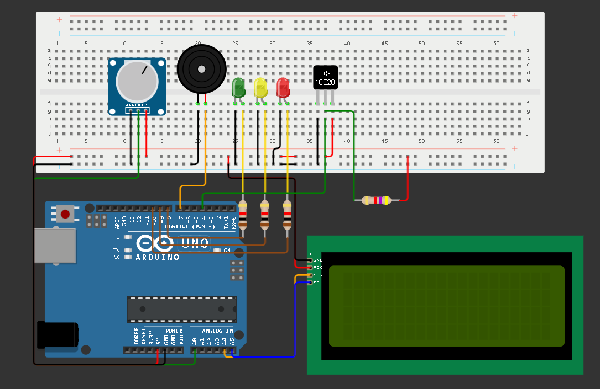

# Projeto de Monitoramento de Temperatura e pH com Arduino

Este projeto monitora a temperatura e o pH de um ambiente utilizando um sensor DS18B20 e um sensor de pH. Os dados são processados e armazenados em arrays, sendo transmitidos em formato JSON via comunicação serial para um aplicativo Python. LEDs e um buzzer são usados para indicar o estado das leituras.

## Índice

1. [Simulação](#simulação)
2. [Componentes Usados](#componentes-usados)
3. [Método de Montagem](#método-de-montagem)
   - [Conecte o Sensor DS18B20](#sensor-ds18b20)
   - [Conecte o Sensor de pH](#sensor-de-ph)
   - [Conecte os LEDs](#leds)
   - [Conecte o Buzzer](#buzzer)
   - [Conecte o LCD](#lcd)
4. [Explicação do Código](#explicação-do-código)
   - [Bibliotecas](#bibliotecas)
   - [Declarações](#declarações)
   - [Configuração Inicial](#configuração-inicial)
   - [Loop Principal](#loop-principal)
   - [readSensors](#readsensors)
   - [updateAvg](#updateavg)
   - [updateStatus](#updatestatus)
   - [soundBuzzer](#soundbuzzer)
   - [updateLCD](#updatelcd)
   - [showLCD](#showlcd)
   - [generateJSON](#generatejson)
5. [Colaboradores do Projeto](#colaboradores-do-projeto)

## Simulação
<a href="https://wokwi.com/projects/399438925654312961" target="_blank" style="text-decoration: none">
<h2>Wokwi</h2>

</a>

## Componentes Usados

**_DISCLAIMER: Como não há o sensor de pH no simulador Wokwi, estamos simulando seu funcionamento com um potênciometro._**

- Arduino Uno (ou equivalente)
- Sensor de Temperatura DS18B20
- Potenciômetro (Sensor de pH)
- Resistor de 4.7kΩ (pull-up para DS18B20)
- 3x Resistores de 1kΩ para os LEDs
- LEDs (3 unidades, cores diferentes preferencialmente)
- Buzzer
- LCD I2C
- Protoboard e Jumpers
- Fonte de Alimentação ou Cabo USB

## Método de Montagem

1. ### Sensor DS18B20:
   - Pino GND do DS18B20 ao GND do Arduino.
   - Pino VDD do DS18B20 ao 5V do Arduino.
   - Pino DATA do DS18B20 ao pino digital 4 do Arduino.
   - Conecte um resistor de 4.7kΩ entre os pinos VDD e DATA do DS18B20 (pull-up resistor).

2. ### Sensor de pH:
   - Pino VCC do sensor de pH ao 5V do Arduino.
   - Pino GND do sensor de pH ao GND do Arduino.
   - Pino de saída analógica do sensor de pH ao pino A0 do Arduino.

3. ### LEDs:
   - Conecte cada LED aos pinos digitais à um resistor de 1kΩ. Em seguida, conecte a outra ponta às portas 8, 9, e 10 do Arduino.
   - O catodo de cada LED deve ser conectado ao GND do Arduino.

4. ### Buzzer:
   - Pino positivo do buzzer ao pino digital 7 do Arduino.
   - Pino negativo do buzzer ao GND do Arduino.

5. ### LCD:
   - Pino VDD do LCD ao 5V do Arduino.
   - Pino negativo do LCD ao GND do Arduino.
   - Pino SDA no pino A4 do Arduino.
   - Pino SCL no pino A5 do Arduino.

## Explicação do Código

### Bibliotecas
```
#include <Wire.h>
#include <OneWire.h>
#include <DallasTemperature.h>
#include <LiquidCrystal_I2C.h>
```

### Declarações
```
const int tempSensorPin = 4; // Pino digital do sensor de temperatura (OneWire)
const int ledPins[3] = {8, 9, 10}; // Pinos dos LEDs
const int buzzerPin = 7; // Pino do buzzer

// Inicializa uma instância do sensor DS18B20
OneWire oneWire(tempSensorPin);
DallasTemperature sensors(&oneWire);

LiquidCrystal_I2C lcd(0x27, 20, 4); // Inicializa os LCDs I2C

// Arrays para armazenar as últimas 10 leituras de temperatura e pH
float temperatureReadings[10];
float pHReadings[10];

float avgReadings[2] = {0, -1}; // Array para armazenar as médias de temperatura e pH

String statusLCD[2]; // Array para armazenar as mensagens exibidas no LCD

int condition = -1; // Representa as condições do ambiente. -1 = Normal/Default, 0 = Ruim (Uma das leituras está fora da faixa ideal), 1 = Extremo (Ambas as leituras estão fora da faixa ideal)
int currentIndex = 0; // Índice atual para armazenar a leitura
int numReadings = 0; // Contador de leituras para verificar se já temos 10 leituras
```

### Configuração Inicial
No setup, inicializamos a comunicação serial, configuramos os pinos dos LEDs e do buzzer, iniciamos o sensor DS18B20 e o LCD.

```
void setup() {
  Serial.begin(9600); // Inicializa a comunicação serial
  sensors.begin(); // Inicializa o sensor DS18B20
  pinMode(buzzerPin, OUTPUT); // Configura o pino do buzzer como saída

  //Inicializando o LCD 
  lcd.init();
  lcd.backlight();
  lcd.clear();

  for (int i = 0; i < 3; i++) {
    pinMode(ledPins[i], OUTPUT); // Configura os pinos dos LEDs como saída
    digitalWrite(ledPins[i], LOW); // Inicialmente desliga todos os LEDs
  }
}
```

### Loop Principal
No loop principal, lemos os sensores, armazenamos os valores em arrays, calculamos as médias e verificamos as condições para acionar os LEDs e o buzzer.
```
void loop() {
  readSensors(); // Lê os valores dos sensores e armazena nas respectivas listas
  currentIndex = (currentIndex + 1) % 10; // Incrementa o índice e o reseta se necessário
  numReadings = min(numReadings + 1, 10); // Incrementa numReadings até o máximo de 10

  // Apenas verifica as médias se já tivermos 10 leituras
  if (numReadings == 10) {
    updateAvg(); // Atualiza os dados das leituras

    updateStatus(); // Atualiza as variáveis de status do Buzzer, LCD e dos LEDs

    String json = generateJSON(); // Gera o JSON que será exibido no Serial
    Serial.println(json); // Envia o JSON via Serial
    numReadings = 0; // Reseta o contador de leituras
  }

  soundBuzzer(); // Controle do buzzer baseado nas condições
  updateLCD(); // Atualiza os status no LCD
  delay(1000); // Aguarda 1 segundo antes de realizar a próxima leitura
}
```


### readSensors
VOID -> Efetua a leitura dos sensores e atualiza as lista de armazenamento.
```
void readSensors(){
  int sensorValuePH = analogRead(A0); // Lê o valor analógico do sensor de pH
  float pH = map(sensorValuePH, 0, 1023, 0, 14); // Mapeia a leitura do potenciômetro de pH para o intervalo de 0 a 14

  // Leitura da temperatura do sensor DS18B20
  sensors.requestTemperatures();
  float temperature = sensors.getTempCByIndex(0); // Obtém a temperatura em graus Celsius

  // Armazena as leituras nos arrays
  temperatureReadings[currentIndex] = temperature;
  pHReadings[currentIndex] = pH;  
}
```

### updateAvg
VOID -> Calcula e atualiza as médias de temperatura e pH.
```
void updateAvg() {
  float sumTemperature = 0;
  float sumPH = 0;

  // Calcula a soma das leituras
  for (int i = 0; i < 10; i++) {
    sumTemperature += temperatureReadings[i];
    sumPH += pHReadings[i];
  }

  // Atualiza a média das leituras
  avgReadings[0] = sumTemperature / 10;
  avgReadings[1] = sumPH / 10;
}
```

### updateStatus
VOID -> Verifica as médias atualizadas e atualiza as variáveis de status do Buzzer, LCD e dos LEDs, conforme necessário.
```
void updateStatus() {
  // Armazena os resultados da verificação em variáveis locais
  bool highTemp = (avgReadings[0] > 24.0);
  bool lowTemp = (avgReadings[0] < 18.0);

  bool highPH = (avgReadings[1] > 8.5);
  bool lowPH = (avgReadings[1] < 7.4);

  // Define as mensagem de temperatura e pH do LCD
  if (highTemp){
    statusLCD[0] = "Alto";
  }else if (lowTemp){
    statusLCD[0] = "Baixo";
  } else {
    statusLCD[0] = "OK";
  }

  if (highPH){
    statusLCD[1] = "Alto";
  }else if (lowPH){
    statusLCD[1] = "Baixo";
  } else {
    statusLCD[1] = "OK";
  }

  bool temperatureOutOfRange = (highTemp || lowTemp);
  bool pHOutOfRange = (highPH || lowPH);

  // Desliga todos os LEDs antes de ligar o correto
  for (int i = 0; i < 3; i++) {
    digitalWrite(ledPins[i], LOW);
  }

  if (temperatureOutOfRange && pHOutOfRange) {
    // Condição extrema: ambos os parâmetros fora dos limites
    condition = 1;
    digitalWrite(ledPins[2], HIGH); // Liga o LED vermelho

  } else if (temperatureOutOfRange || pHOutOfRange) {
    // Condição ruim: pelo menos um dos parâmetros fora dos limites
    condition = 0;
    digitalWrite(ledPins[1], HIGH); // Liga o LED amarelo

  } else {
    // Condição normal: ambos os parâmetros dentro dos limites
    condition = -1;
    digitalWrite(ledPins[0], HIGH); // Liga o LED verde
  }
}
```

### soundBuzzer
VOID -> Toca o som do buzzer de acordo com o status de condição da água atual.
```
void soundBuzzer(){
  switch (condition) {
    case 1:
      tone(buzzerPin, 250, 100); // Som para condições extremas
      break;
    case 0:
      tone(buzzerPin, 500, 100); // Som para condições ruins
      break;
    default:
      delay(100);
      break;
  }
}
```

### updateLCD
VOID -> Atualiza o texto exibido no LCD.
Sempre exibe a leitura atual. A cada 10 leituras, atualiza os valores de temperatura e pH.
```
void updateLCD(){
  lcd.clear(); // Limpa o LCD
  showLCD(0, "Leitura: "+String(numReadings + 1)); // Imprime o número da leitura atual;

  if (avgReadings[1] < 0) {
    showLCD(1, "Temp: Verificando");
    showLCD(2, "pH: Verificando");

  } else {
    // Criação de char para o simbolo °
    byte degree[8] = {B00000, B01100, B10010, B10010, B01100, B00000, B00000, B00000};
    lcd.createChar(0, degree);
    
    lcd.setCursor(0, 1);
    lcd.print("Temp: " + String(avgReadings[0], 2)+" ");
    lcd.write(byte(0));
    lcd.print("C");

    if (!(statusLCD[0].equals("OK"))){
      showLCD(2, "-> "+statusLCD[0]);
      showLCD(3, "pH: " + String(avgReadings[1], 2)+" - "+statusLCD[1]);
    } else {
      lcd.print(" - "+statusLCD[0]);
      showLCD(2, "pH: " + String(avgReadings[1], 2)+" - "+statusLCD[1]);
    }
  }
}
```


### showLCD
VOID -> Função genérica para exibições no LCD
INT row -> Linha do LCD que será escrita
STRING text -> Texto que será exibido no LCD
```
void showLCD(int row, String text) {
  lcd.setCursor(0, row); // Define a linha do LCD que será utilizada
  lcd.print(text); // O texto que será exibido no LCD
}
```

### generateJSON
STRING -> Retorna um JSON gerado a partir dos dados armazenados das últimas 10 leituras e suas médias.
```
String generateJSON() {
  // Criação do JSON para os arrays de leituras
  String json = "{\"temperaturas\":[";
  for (int i = 0; i < 10; i++) {
    json += String(temperatureReadings[i]);
    if (i < 9) {
      json += ",";
    }
  }

  json += "],\"pH\":[";
  for (int i = 0; i < 10; i++) {
    json += String(pHReadings[i]);
    if (i < 9) {
      json += ",";
    }
  }
  json += "],\"mediaTemp\":" + String(avgReadings[0],2) + ",\"mediapH\":" + String(avgReadings[1],2) + "}";
  return json;
}
```


## Colaboradores do Projeto
<div>
<a href="https://github.com/desenise" target="_blank" style="text-align: center; margin-right: 10px;">

<p style="font-size:min(2vh, 36px); margin-top: 10px;">Denise Senise - RM 556006</p>
</a>
<a href="https://github.com/dav0fc" target="_blank" style="text-align: center; margin-right: 10px;">

<p style="font-size:min(2vh, 36px); margin-top: 10px;">	David Gabriel Gomes Fernandes - RM 556020</p>
</a>
<a href="https://github.com/MateusLem" target="_blank" style="text-align: center; margin-right: 10px;">

<p style="font-size:min(2vh, 36px); margin-top: 10px;">Mateus da Costa Leme - RM 557803</p>
</a>
</div>